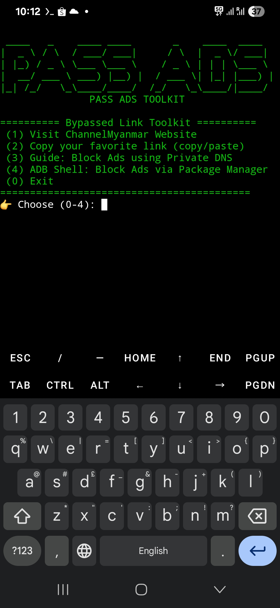

## Steps to Use the AdPass_channel-myanmar.crx Extension on Android Devices:

1. Configure [Private DNS](https://news.trendmicro.com/2023/03/21/how-to-turn-on-private-dns-mode/):

Open your Phone Settings.

Go to Connections or Network & Internet (depending on your device).

Select More Network Settings or Advanced.

Tap on Private DNS.

Choose Private DNS provider hostname.

Enter: dns.adguard.com and tap Save.


2. Install Extension in Kiwi Browser:

Open the Kiwi Browser (make sure it’s the one provided).

Tap the three-dot menu in the top right corner.

Scroll down and select Extensions.

Enable Developer mode.

Locate the provided file: AdPass_channel-myanmar.crx and load it into the browser (drag and drop or open from file manager).

Close and reopen the browser.


3. Result:

Now, when browsing websites like cm, ads and popups (especially during video playback) will be completely blocked.




## Extension v1.0

# This tool can be installed on your device using 
# Chrome Browser for PC and [Kiwi Browser](https://play.google.com/store/apps/details?id=com.kiwibrowser.browser) for mobile.

# [Download Chrome Extension (.crx)](https://github.com/joephyu/bypassAd/releases/download/v1.0.0/AdPass_channel-myanmar.crx)

## Demo Extension file installation 


## Demo Termux


# Bypass annoying ads with a simple [Termux](https://play.google.com/store/apps/details?id=com.termux) and Linux script.
##  Installation

Clone the repo and run the script:

```bash
git clone https://github.com/joephyu/bypassAd.git
cd bypassAd
chmod +x bypassAd.sh
./bypassAd.sh

or

./by*.sh

